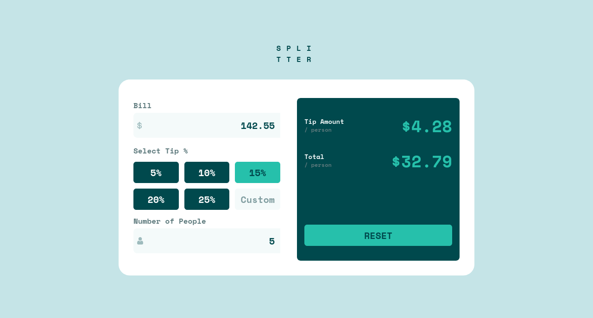

# Frontend Mentor - Tip calculator app solution

This is a solution to the [Tip calculator app challenge on Frontend Mentor](https://www.frontendmentor.io/challenges/tip-calculator-app-ugJNGbJUX). Frontend Mentor challenges help you improve your coding skills by building realistic projects.

## Table of contents

- [Frontend Mentor - Tip calculator app solution](#frontend-mentor---tip-calculator-app-solution)
  - [Table of contents](#table-of-contents)
  - [Overview](#overview)
    - [The challenge](#the-challenge)
    - [Screenshot](#screenshot)
    - [Links](#links)
  - [My process](#my-process)
    - [Built with](#built-with)
    - [What I learned](#what-i-learned)
    - [Continued development](#continued-development)
    - [Useful resources](#useful-resources)
  - [Author](#author)
  - [Acknowledgments](#acknowledgments)


## Overview

### The challenge

Users should be able to:

- View the optimal layout for the app depending on their device's screen size
- See hover states for all interactive elements on the page
- Calculate the correct tip and total cost of the bill per person

### Screenshot



### Links

- Solution URL: [Frontend Mentor](https://www.frontendmentor.io/solutions/tip-calculator-app-main-using-react-tailwindcss-vite-dZiXkLfzQP)
- Live Site URL: [Github Pages](https://zenitsuag.github.io/tip-calculator-app-main/)

## My process

### Built with

- Flexbox
- CSS Grid
- Mobile-first workflow
- [React](https://reactjs.org/) - JS library
- [Tailwind CSS](https://tailwindcss.com/) - CSS Framework

### What I learned

I learnt React. This is the first time I've done anything in React and there are alot of things I would like to highlight but I will just talk of the awesomeness of `state` and `conditonal rendering`, these are game changers, like having a fully interactive app with so little code increase productivity exponentially.
```jsx
  const [person, setPerson] = useState(1);
```
```jsx
  {person == 0 && <p className='bg-red-600'>Can't be zero</p>}
```
In the second snippet, if the value of `person` is zero, this `p` tag is visible on the page just like that!!

### Continued development

I'm going to work hard and improve my skills, once I'm done with React Docs, I'll move on to NextJS and continue soaring...

### Useful resources

- [React Docs](https://react.dev/) - This helped me a lot, transitioning from writing vanilla JS to React was not by any means easy. I'm super excited to see where how this goes. My code feels more organized and like there's a lot of possibilities which each challenge that pops up, it's amazing.

## Author

- Website - [Fred Robins](https://github.com/ZenitsuAg/)
- Frontend Mentor - [@ZenitsuAg](https://www.frontendmentor.io/profile/ZenitsuAg/)
- Twitter - [@r9_freddy](https://www.twitter.com/r9_freddy)

## Acknowledgments

- I give thanks to you, God Almighty for your grace and continuous support. Without you Lord Jesus, I wouldn't have come this far.